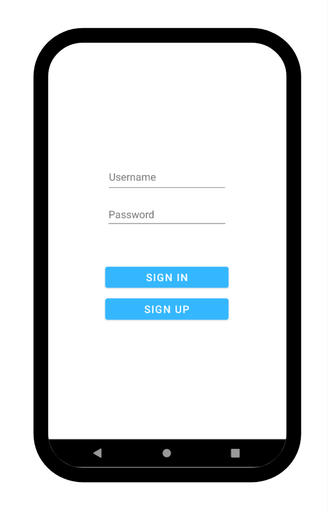
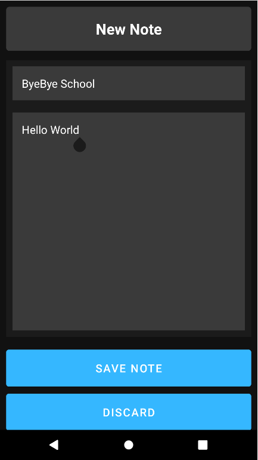

# Calendar Note Share

A collaborative Android application that allows users to add notes to specific calendar dates for everyone to see. Built with Java and backed by MongoDB Atlas for cloud storage.

## Table of Contents

- [Overview](#overview)
- [Screenshots](#screenshots)
- [Features](#features)
- [Architecture](#architecture)
- [Technology Stack](#technology-stack)
- [Project Structure](#project-structure)
- [API Endpoints](#api-endpoints)
- [Setup and Installation](#setup-and-installation)
- [Usage](#usage)
- [Team Contributions](#team-contributions)

## Overview

Calendar Note Share is an Android application designed for shared note-taking on a calendar interface. Users can register, log in, select any date on the calendar, and add notes that are stored in the cloud. All notes are accessible by any user, making it ideal for team coordination, shared reminders, or community bulletin boards.

## Screenshots

| Login Screen | Note Creation |
|--------------|---------------|
|  |  |

## Features

### User Authentication
- **User Registration**: Create a new account with username and password validation
- **User Login**: Secure authentication against MongoDB backend
- **Session Management**: Logout functionality to securely end sessions

### Calendar Interface
- **Interactive Calendar Widget**: Full calendar view with date selection
- **Date-Based Navigation**: Select any date to view or add notes
- **Timezone Support**: Uses America/Los_Angeles timezone for date calculations

### Note Management
- **Add Notes**: Create notes with title and content for any selected date
- **View Notes**: Display all notes for a specific date in a scrollable list
- **Shared Access**: All users can view notes added by anyone

## Architecture

The application follows a standard Android activity-based architecture:

```
                    +------------------+
                    |   login.java     |
                    | (Authentication) |
                    +--------+---------+
                             |
                             v
                    +------------------+
                    | MainActivity.java|
                    |   (Calendar)     |
                    +--------+---------+
                             |
              +--------------+--------------+
              |                             |
              v                             v
    +------------------+          +------------------+
    |noteaddActivity   |          |notelistActivity  |
    | (Create Notes)   |          | (View Notes)     |
    +------------------+          +------------------+
              |                             |
              +-------------+---------------+
                            |
                            v
                    +------------------+
                    |  MongoDB Atlas   |
                    | (Cloud Database) |
                    +------------------+
```

### Activity Flow

1. **login.java** - Entry point; handles user registration and login
2. **MainActivity.java** - Main hub with calendar widget and navigation buttons
3. **noteaddActivity.java** - Form for creating new notes with title and content
4. **notelistActivity.java** - Displays notes for selected date using RecyclerView
5. **RecyclerAdapter.java** - Custom adapter for rendering note items in the list

## Technology Stack

### Frontend (Android)
| Component | Version | Purpose |
|-----------|---------|---------|
| Android SDK | API 32 (compileSdk) | Core Android framework |
| Min SDK | API 21 (Android 5.0) | Minimum supported version |
| AndroidX AppCompat | 1.4.1 | Backward-compatible UI components |
| Material Design | 1.5.0 | Material Design components |
| ConstraintLayout | 2.1.3 | Flexible UI layouts |
| RecyclerView Selection | 1.1.0 | List display with selection support |
| Volley | 1.2.1 | HTTP networking library |

### Backend
| Component | Purpose |
|-----------|---------|
| MongoDB Atlas | Cloud-hosted NoSQL database |
| MongoDB Realm | Serverless backend functions |
| HTTPS API | RESTful endpoints for data operations |

### Build Tools
| Tool | Version |
|------|---------|
| Gradle | Project build automation |
| Java | 1.8 (source/target compatibility) |

## Project Structure

```
CalendarNoteShare/
├── app/
│   ├── src/main/
│   │   ├── java/com/example/calendarapp/
│   │   │   ├── login.java              # Authentication activity
│   │   │   ├── MainActivity.java       # Calendar view and navigation
│   │   │   ├── noteaddActivity.java    # Note creation form
│   │   │   ├── notelistActivity.java   # Note list display
│   │   │   └── RecyclerAdapter.java    # RecyclerView adapter
│   │   ├── res/
│   │   │   ├── layout/
│   │   │   │   ├── activity_login.xml      # Login screen layout
│   │   │   │   ├── activity_main.xml       # Calendar screen layout
│   │   │   │   ├── activity_noteadd.xml    # Note creation layout
│   │   │   │   ├── activity_notelist.xml   # Note list layout
│   │   │   │   └── recycler_view_item.xml  # Individual note item
│   │   │   ├── drawable/
│   │   │   │   ├── layout_bg.xml       # Input field backgrounds
│   │   │   │   └── recycle_bg.xml      # RecyclerView background
│   │   │   └── values/
│   │   │       ├── colors.xml          # Color definitions
│   │   │       ├── strings.xml         # String resources
│   │   │       └── themes.xml          # App theme and styles
│   │   └── AndroidManifest.xml         # App configuration
│   └── build.gradle                    # App-level dependencies
├── build.gradle                        # Project-level configuration
├── settings.gradle                     # Project settings
└── README.md                           # This file
```

## API Endpoints

The application communicates with MongoDB Realm through the following REST endpoints:

### Authentication

**Check User Credentials (GET)**
```
GET /api/get/onUser?user={username}&pass={password}
```
Returns a JSON object with an `arr` array containing matching users.

**Register New User (POST)**
```
POST /api/POST/user
Body: { "user": "username", "pass": "password" }
```
Creates a new user document in the database.

### Notes

**Get Notes by Date (GET)**
```
GET /api/get/onDate?year={year}&month={month}&day={day}
```
Returns all notes for the specified date.

**Add New Note (POST)**
```
POST /api/POST/insert
Body: { "title": "Note Title", "noteContent": "Note content...", "year": 2024, "month": 1, "day": 15 }
```
Inserts a new note into the database.

## Setup and Installation

### Prerequisites

- Android Studio (Arctic Fox or later recommended)
- JDK 8 or higher
- Android SDK with API level 32
- Internet connection for MongoDB Atlas access

### Installation Steps

1. **Clone the Repository**
   ```bash
   git clone https://github.com/your-username/CalendarNoteShare.git
   cd CalendarNoteShare
   ```

2. **Open in Android Studio**
   - Launch Android Studio
   - Select "Open an existing Android Studio project"
   - Navigate to the cloned directory and select it

3. **Sync Gradle**
   - Wait for Android Studio to sync the Gradle files
   - If prompted, update any dependencies

4. **Configure Emulator or Device**
   - Create an AVD (Android Virtual Device) with API 31 or higher
   - Or connect a physical device with USB debugging enabled

5. **Build and Run**
   - Click "Run" or press `Shift+F10`
   - Select your target device
   - The app will build and launch

### Troubleshooting

- **Build errors**: Ensure you have the correct SDK versions installed via SDK Manager
- **Network errors**: Verify internet connectivity; the app requires access to MongoDB Atlas
- **Gradle sync issues**: Try "File > Invalidate Caches / Restart"

## Usage

### Getting Started

1. **Launch the App**
   - Open the application on your device or emulator

2. **Create an Account**
   - Enter a username and password
   - Tap "SIGN UP" to register

3. **Log In**
   - Enter your credentials
   - Tap "SIGN IN" to access the calendar

### Using the Calendar

1. **Select a Date**
   - Tap any date on the calendar widget
   - The selected date will be used for adding or viewing notes

2. **Add a Note**
   - Tap "Add Note"
   - Enter a title and content
   - Tap "SAVE NOTE" to store it
   - Tap "DISCARD" to cancel

3. **View Notes**
   - Tap "View Notes"
   - All notes for the selected date will be displayed
   - Tap "Back To Calendar" to return

4. **Log Out**
   - Tap "Logout" to return to the login screen

## Team Contributions

| Team Member | Responsibilities |
|-------------|------------------|
| **Ming Xia** | Frontend layout design and UI styling |
| **Quinn Croes** | Interface creation and user experience |
| **McGuire Croes** | Initial project structure and calendar implementation |
| **Colton Berry** | Database endpoints, API integration, and note functionality |
| **Andrew Keyes** | User registration and login system |

## License

This project was created for educational purposes.

---

*Built with Android Studio and MongoDB Atlas*
